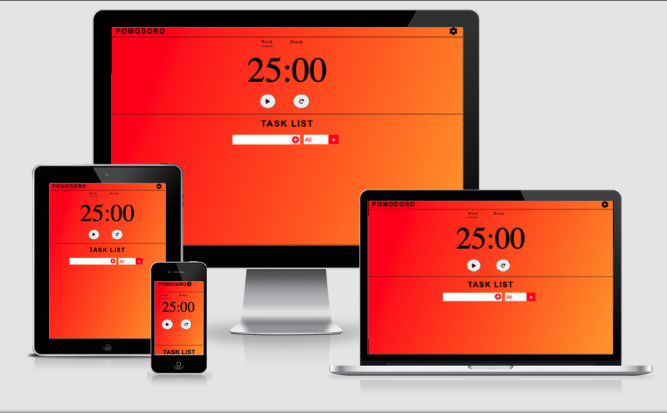
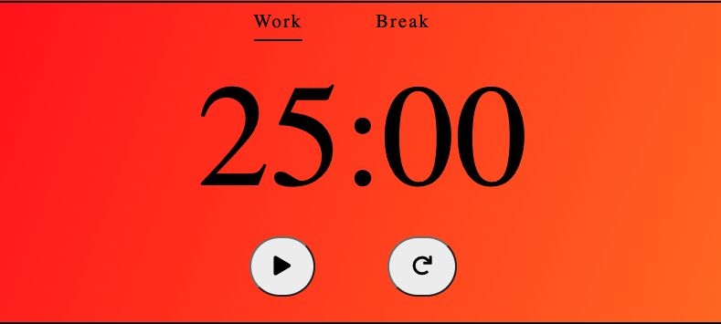
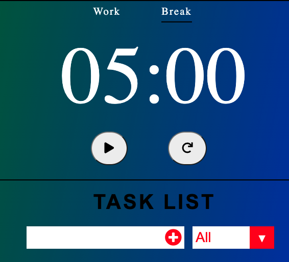
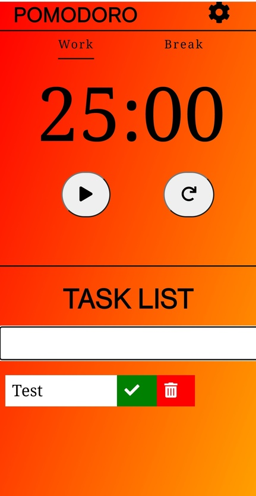
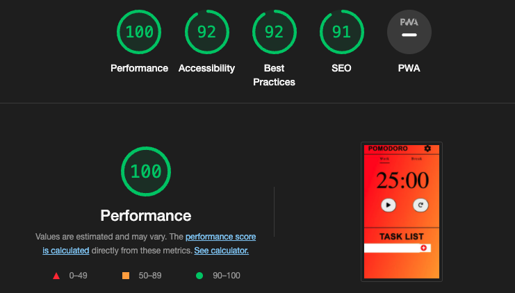

# **_Pomodoro Timer - Project Portfolio 2 - Javascript essentials_**
Pomodor Timer is space where you can make the best use of your own time. A completely variable alternating timer that makes sure you have the breaks you need while still ensuring you get your work done.
This project is for educational purposes. My main aim is to build a responive Website using HTML, CSS and Javascript.

## [View life website in github pages](https://mark8495.github.io/CI-Project-Portfolio-2/)

---

# Contents

- [User Experience](#user-experience)
- [Website Structure](#website-structure)
- [Features](#features)
- [Technologies](#technologies)
- [Testing](#testing)
- [Credits](#credits)

# User Experience

## Website Goals:
The goal of the website is to make a space where you can work in peace and efficently with sufficent breaks between work time. It also has the ability to allow users to track their tasks so they know exactly what they are doing and what they need to do next.

### User Goals:
- User is able to set timer for their preferred work and break time.
- User can easily add and manage their Tasks that they need to complete.

### Returning User Goals:
- Users have a record of what times they like to use for easier setup.
- Tasks are saved so they always know what needs to be done.

## User Stories:

### As a new user:
* I wish to be able to set timers to be able to clear plan out when I will be working and when I will be taking a break in a given time period.
* I want the ability to note down what tasks I have to do, and have the ability to mark when they are complete and delete them.
### As a returning User
* I want to be able to return to website knowing what tasks I still have left from the previous session.

# Website Structure

## Wireframes
I used the website Figma to create the wireframe.

### Colours
I wanted a clear difference between the colors of the website while it was in work mode and while it was in break mode.
### Fonts

[Table of Contents](#Contents)

---
# Features
There were several essential features I wanted for this project. A variable timer being chief among them. Along with the timer, I also wanted a good

## Navigation Bar

I wanted the navigation bar to be simple and easy to use, the name of the website and a settings button was all that I needed to add to provide full functionality of the nav bar. Clicking the settings icon will open up a modal that provides all the options you might need to change the Timer.

## Pomodoro Timer

I wanted the timer to be the main feauture for the website, as using one has always been a method of working that has been beneficial for me. Having the ability to set what time you want was also an essential edition.

## Break Mode

After work has been complete I want their to be a stark difference between the site whether the timer is being used as a break countdown. The color change to a calming blue and green

## Tasks

The task list is a handy addition to the pomodor timer page. With it you can keep track of any tasks you might have. Keeping the data locally so as long as you don't delete the task it will always stick around.

## Media Changes

There were only minor changes needed for the site to be functional on all screen sizes. To make the most out of the screen space I removed the ability to filter tasks for a cleaner layout on the mobile.

# Technologies
### HTML5
* As a structure language.

### CSS
* As a style language.

### JavaScript
* As a language to add functionality to the Website.

### Font Awesome
* As an icon library for a social links.

### Google fonts
* As a font resource.

### GitHub
* As a software hosting platform to keep project in a remote location.

### Git
* As a version-control system tracking.

### Gitpod
* As a development hosting platform.

## Code Validation
At the and of the project I used two websites to validate a code
 
 * [W3C CSS Validator](https://jigsaw.w3.org/css-validator/) to validate CSS
 * [Nu Html Checker](https://validator.w3.org/) to test HTML
 * [Js Hint](https://jshint.com/) to test javascript

I have also run the website through google's lighthouse testing.

## Issues found during site development.
### Input issues with settings in the Safari Browser.

In the Safari browser, number inputs still allowed the user to input other characters. 
To fix this I removed all characters inputted after the button for the timers settings was clicked, along with an alert if the input didn't equal what is required. 

# Deployment

The project was deployed on GitHub Pages. I used Gitpod as a development environment where I commited all changes to git version control system.
I used push command in Gitpod to save changes into GitHub.

To deploy a project I had to:

* Log in to GitHub and click on repository to deploy ([P2](https://github.com/Mark8495/CI-Project-Portfolio-2))
* select `Settings` and find GitHub Pages section at the very bottom of the page
* click `save` and page was deployed after auto-refresh.
>  Your site is published at https://mark8495.github.io/CI-Project-Portfolio-2/

To run localy:
* Log in to GitHub and click on repository to download ([P2](https://github.com/Mark8495/CI-Project-Portfolio-2))
* select `Code` and click Download the ZIP file.
* After download you can extract the file and use it in your local environment 

# Credits

* To complete this project I used Code Institute student template: [gitpod full template](https://github.com/Code-Institute-Org/gitpod-full-template)

* Modal example:

    * [w3schools.com](https://www.w3schools.com)

* Icon source

    * [Font awesome](https://fontawesome.com/icons)

* Sounds source

    * [MixKit](https://mixkit.co/free-sound-effects/alarm/)

## Special Thanks
To the Code Institute course material that gave me the knowledge and confidence to complete this project.

To my mentor Adegbenga Adeye who gave me great help and directions throughout the project
